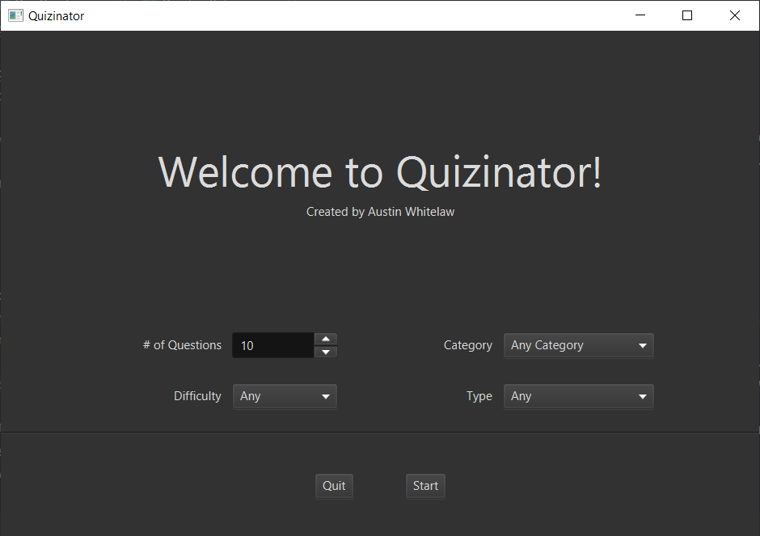

# Quizinator

Quizinator is a JavaFX desktop application that makes use of the Open Trivia Database API in order to generate a random quiz that can be customized by category, difficulty, etc.

## Features

- Generate a random quiz using Open Trivia Database API
- Customize number of questions, difficulty, category, and type
- Move forward and backward between questions seamlessly
- Calculate score and display breakdown of correct and incorrect answers

### Built with:

- Maven
- Java 18
- JavaFX 18
- Jackson
- Apache Commons Text

This project was built inside IntelliJ IDEA using the Java 18 SDK. The pom.xml file already includes JavaFX 18, Jackson, and Apache Commons Text. As long as you have the Java 18 SDK and can run a Maven project, you should be good to go. Jackson is used to map the JSON response to Java objects, and Apache Commons Text is used to unescape HTML entities in the question and answer text.

Note: It is unclear whether this project will work with older versions of Java or not. If you are using an older version of Java, you may need to make adjustments to the code or update your version of Java in order to run this project.

## How to Use

 Simply clone this repository and run this project in your favorite IDE. Once Maven loads all the dependencies, you should be able to run the application without any issues.

## Thanks

- [Open Trivia Database](https://opentdb.com/)
- [JavaFX Dark Theme](https://github.com/joffrey-bion/javafx-themes) by joffrey-bion
